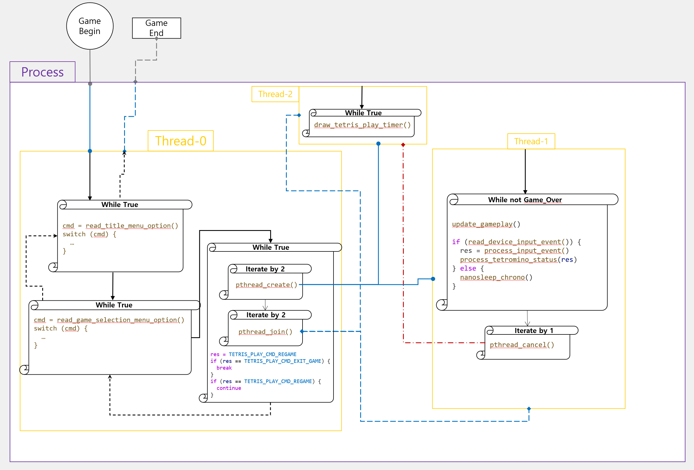

# Solution

[요구 사항 분석서](./requirements_analysis.md)(주로 [가이드라인](../tetris%20guideline%20docs%202009/2009%20Tetris%20Design%20Guideline.pdf) 위주)의 내용을 실제로는 어떻게, 어디까지 구현했는지를 서술한다.

---

## Index

[주요 로직 설명](#)  
[소스코드별 설명](#)  

---

## 주요 로직 설명

### Q1. 프로그램 흐름도

우선 게임 흐름을 **겉으로 보이는 사용자와의 접점**만 감안하여 **사용자 입장**에서 작성해 보면 다음과 같다.  

(가이드라인에 따르면 원래는 `Esc`를 누르면 **EXIT**이 아니라 **PAUSE**를 해야 한다. 여력이 없어 **PAUSE**를 구현하지 못했다.  
또한 게임 오버 시에도 따로 메시지를 띄워서 한 판 더 할 것인지, 아님 게임 선택 화면으로 돌아갈 것인지 묻게끔 구현해야 하는데  
그러지 못하고 바로 게임을 시작하게끔 하였다.)

이를 프로세스 관점에서 다시 보면 아래와 같다.  
(실제 함수 호출 구조나 로직은 좀 더 복잡하지만 편의상 주요 흐름 정도만 간단하게 표시했다.)

경과 시간을 표시하는 타이머(**Thread-2**)를 게임 루프(**Thread-1**)와 독립적으로 실행하기 위해  
멀티 스레스를 사용함을 알 수 있다.

(`Esc` 눌렀을 때 `exit()` 호출하는 건 어떻게 표현하지..?)

---

### 멀티 스레드 구조 설계

### 게임 프레임(루프)

### 입력 이벤트 처리

### 테트로미노 모델링

---

## 소스코드별 설명

---
