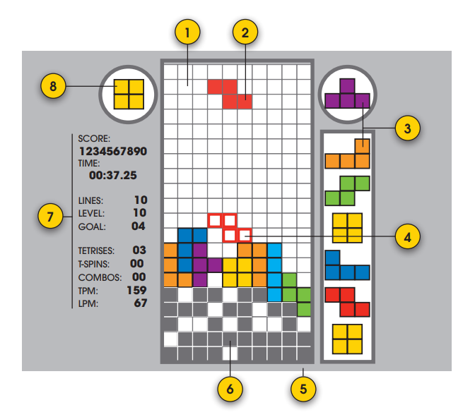
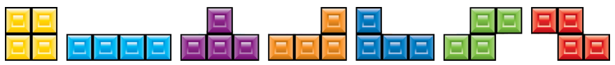

# 2009 Tetris Design Guideline

[원문](../tetris%20guideline%20docs%202009/2009%20Tetris%20Design%20Guideline.pdf)의 일부만 번역하였다.

## 목차

1. [도입](#1-도입)
2. 기본 게임 흐름
3. 테트로미노 생성
4. 컨트롤
5. 테트로미노 조작
6. 레벨 및 목표
7. 낙하 속도
8. 점수 시스템
9. T-spin이란?
10. 게임 오버 조건
11. 게임 오버 이벤트
12. 주요 테트리스 변종
13. 시각/음향 효과 및 음악

## 1. 도입

### 1.1 테트리스는 어떤 게임인가?

테트리스는 인간의 가장 기본적인 욕구 중 하나인 혼돈에서 질서를 만들고자 하는 욕구를  
충족시키는 게임이다. 직사각형 매트릭스 상에서 떨어지는 7개의 다른 모양의 테트로미노가 있다.   
플레이어는 테트로미노를 최종 안식처로 회전, 이동 또는 드롭할 수 있다. 하나의 이상의 셀이  
블록으로 완전히 채워지면 해당 라인이 매트릭스에서 지워지고 점수가 계산된다. 플레이어가  
매트릭스에서 라인을 더 효율적으로 제거할수록 (예를 들어, 더 적은 시간에 또는 동시에 더 많은 라인을 제거)  
고득점에 유리하다.  
'동시 라인 클리어', "T-스핀", "Back-To-Back" 등의 특수 액션을 달성하면 보너스 점수가 주어진다.  
(닳고 닳은 고인물 게임이다 보니 각종 테크닉에 따른 점수 시스템이 갖춰져 있는 듯)

### 1.2 테트리스 기초 용어

**Block**: 매트릭스의 셀에 잠긴(Lock Down) 단일 블록. 기존 블록이라고도 한다.  

**Block Out**: 이제 막 새로 생성된 테트로미노의 일부가 매트릭스의 기존 블록으로 인해 막힐 때 발생하는 **게임 종료 상태**(Game Over Condition)이다.  

**Buffer Zone**: Lock Out, Block Out, Top out와 같은 게임 종료 상태를 감지하는 데 사용되는 매트릭스 위 10 x 20의 셀로 이루어진 보이지 않는 영역.  

**Line Clear**: 가로 행이 블록으로 완전히 채워지면 매트릭스에서 제거되는 상태. 클리어된 라인 위의 모든 조각(piece)은 아래로 이동하여 공간을 채운다.  

**Lock Down**: 플레이 중인(매트릭스에 나와 있는) 테트로미노가 잠겨 플레이어가 이를 더 이상 조작할 수 없는 지점.  
일반적으로 테트로미노가 지면(매트릭스의 바닥이나 기존 블록)에 착지하고 나서 0.5초 후에 발생한다.  

**Lock Out**: 테트로미노가 스카이라인 위에서 완전히 잠길 때 발생하는 **게임 종료 상태**.  

**Matrix**: 활성 게임 영역을 만드는 직사각형 셀 배열로, 일반적으로 너비 10열 x 20행이다.  

**Mino**: 테트로미노를 이루는 단일 정사각형 모양의 구성 요소이다.  

**Skyline**: 매트릭스 상단의 수평선. 테트로미노는 스카이 라인 바로 위에서 떨어지기 시작한다.  

**Tetromino(테트로미노)**: 측면을 따라 연결된 4개의 미노들로 구성된 기하학적 Tetris® 모양.  
각각 고유한 색상으로 표시되는 4개의 미노들을 사용하여 총 7개의 테트로미노를 만들 수 있다.  

테트로미노(Tetromino)에 대해 더 자세히 알고 싶다면 -> [위키피디아](https://en.wikipedia.org/wiki/Tetromino)

- **O-Tetromino**: 노란색; 정사각형 모양; 2×2 정사각형에 4개의 블록이 위치.
- **I-Tetromino**: 하늘색; 대문자 I 모양; 직선으로 4개의 블록.
- **T-Tetromino**: 보라색; 대문자 T 모양; 세 개의 블록 행의 가운데 위에 블록 하나가 추가된.
- **L-Tetromino**: 오렌지; 대문자 L 모양; 세 개의 블록 행의 오른쪽 위에 블록 하나가 추가된.
- **J-Tetromino**: 진한 파란색; 대문자 J 모양; 세 개의 블록 행의 왼쪽 위에 블록 하나가 추가된.
- **S-Tetromino**: 녹색; 대문자 S 모양; 위쪽 하나가 오른쪽으로 치우친 2층 짜리 수평 도미노.
- **Z-Tetromino**: 빨간색; 대문자 Z 모양; 위쪽 하나가 왼쪽으로 치우친 2층 짜리 수평 도미노.

**Tetris®**: 본 게임의 명칭. 수직 I-Tetromino를 사용하여 동시에 4개의 라인을 제거하는 행위를 일컬으며 고득점 보너스를 얻을 수 있다.  

**Top Out**: 플레이어가 받은 새로운 블록 라인이 (주로 멀티 플레이에서 상대방의 공격에 의한) 플레이어의 기존 블록을 Buffer Zone의 상단에 도달하여 탑 아웃 라인을 지나도록 강제할 때 발생하는 **게임 종료 상태**이다.

**Top Out Line**: 스카이라인에서 20줄 위에 있는 버퍼 존의 천장. 테트리스에서 절대적 최상위 라인이다.

**T-Slot**: T-Tetromino가 회전할 때 T-Tetromino의 중심에 대각선으로 인접한 4개의 셀 중 3개가 기존 블록으로 채워지는 모든 류의 블록 형성을 일컫는다.

**T-Spin**: T-Tetromino가 지면에 착지하여 Lock Down되기 전에, T-Slot에서 회전을 수행하는 행위이다.

## 2. 기본 게임 흐름

### 2.1 인터페이스

#### 1. The Matrix
게임 플레이가 발생하는 영역이다. 표준 매트릭스 치수는 높이 20셀 x 너비 10셀이다.

#### 2. Tetromino in Play
매트릭스에 들어와 있는 테트로미노.  
플레이어는 이 테트로미노를 오른쪽 또는 왼쪽으로 이동하고, 시계 방향 또는 반시계 방향으로 회전하고, 하드 또는 소프트 드롭으로 조작할 수 있다.  
하드 드롭을 하면 테트로미노가 즉시 똑바로 떨어져서 착지한 첫 번째 표면에 고정된다(잠긴다).  
소프트 드롭은 버튼을 놓을 때까지 현재 낙하 속도보다 20배 빠르게 테트로미노를 떨어뜨린다.

#### 3. Next Queue
넥스트 큐를 통해 플레이어는 생성되어 플레이에 투입될 다음 테트로미노를 볼 수 있다. Matrix의 오른쪽 상단 근처에 있어야 한다. 이상적으로는 다음 6개의 테트로미노가 이 대기열에 표시되어야 하지만 이는 1에서 6까지 다양할 수 있다. 대기열은 수직 또는 수평일 수 있으며 매트릭스에 들어갈 다음 테트로미노는 매트릭스 상단에 가장 가깝다. 테트로미노는 대기열에서 다음과 같이 북쪽 방향을 가리켜야 한다.

대기열의 테트리미노에 애니메이션이 제공되는 경우 플레이어의 주변 시야에서 쉽게 구분할 수 있도록 하는 것이 최우선 순위이다.

#### 4. Ghost Piece
플레이 중인 테트로미노의 복사본이며 플레이어에게 플레이 테트로미노가 현재 위치에서 "떨어지면" 멈출 위치를 알려준다. 고스트 피스는 테트로미노 윤곽선 또는 테트로미노의 반투명한 "유령" 이미지로 나타날 수 있다. 다음 테트로미노의 생성 순간에 항상 북쪽을 향하여 처음 나타난다.

#### 5. Background Graphic
배경 그래픽은 화면 요소가 나타나는 배경이다. 제품의 특성(개성)과 광택(세련됨, 우아함)을 제공한다. 시각적으로 게임 플레이를 방해해서는 안된다.

#### 6. Starting Blocks
여러 Tetris 제품 변형을 통해 플레이어는 시작 블록의 행 수를 변경할 수 있다.
게임 시작 시 매트릭스 하단에 표시된다.

#### 7. Game Information
플레이 중인 게임과 관련된 정보가 화면에 표시된다. 가능한 항목은 다음과 같다.

#####  게임 타입
##### 지워진 줄 수 / 지워야 할 남은 줄 수
##### 현재 레벨
##### 경과시간/남은시간
##### 현재 점수
##### 높은 점수
##### 선수 이름
##### 플레이어 순위

#### 8. Hold Queue
홀드 큐를 통해 플레이어는 떨어지는 테트리미노를 원하는 만큼 "고정"할 수 있다.  
테트리미노를 들고 있으면 홀드 큐에 이미 있는 테트리미노가 해제된다(존재하는 경우).  
매트릭스의 왼쪽 상단에 위치하며, 테트로미노는 Next Queue에서와 마찬가지로 항상 북쪽을 향하고 있다.